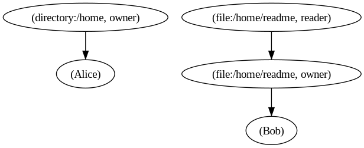

# Grokking Zanzibar's Access Control

The idea of this article is to give an introduction to Zanzibar Access Control and a mental model to understand it.

Zanzibar was first introduced by Google in their [whitepaper][zanzi].
In essence, Zanzibar is an Authorization Service which powers Google's services.
Its main purpose boils down to answering the question:
> can user U do operation O over object A?

In this article we'll try explore how Zanzibar was designed to fulfill Access Requests and hopefuly develop a mental model of the primary elements in Zanzibar.

## RelBAC

A little backgroun about authorization and access control is in order.

The field of Access Control is a branch which studies how to manage who or what can operate a certain resource within a system, which is to say, whether something has a permission to do something.
Zanzibar is an implementation which closely resembles the model known as "Relation Based Access Control" (RelBAC).

The primary idea behind RelBAC is that objects within a system have relations amongst themselves, and through these relations one can figure out the golden Access Control query, ie. "who or what can operate over a resource within a system".
This notion of relations should feel familiar to Relational Databases and Class Diagrams in Object Oriented Modeling.

To illustrate RelBAC take the familiar example of: "a book is written by an author".
From that sentence we can identify two entities, "book" and "author.
Furthermore there exists a relation between these two entities, a book was *authored* by an author.
The key to RelBAC is noticing that this relation can be used to derive permissions.
The book's author should be able to read and edit their own book - meaning the operations "read" and "edit" should be allowed for an author.

Let's extend this example just a step further, suppose a book also has a publisher and an editor.
The relations "editor" and "publisher" themselves imply permissions.
The publisher certainly should be able to read the published book but probably not edit it.
Moreover an editor should read and perhaps leave comments.

These relations exist in virtualy every problem domain, so much so there are specialized fields dedicated to studying how to express those relations, such as Descriptor Logic.
RelBAC exploits these relations in order to figure out permissions.


## Zanzibar's RelBAC

A very important concept drawn from Zanzibar is that of Relation Tuples, which are used to represent a Relation between system objects.

The Relation Tuple has a simple definition given as:

```
tuple = (object, relation, user)
object = namespace:id
user =  object | (object, relation)
relation = string
namespace = string
id = string
```

Intuitively, a Relation Tuple is a 3-tuple which contains a reference to an object, some named relation and an user.
The 3-tuple ("article:zanzibar", "publisher", "coorporation:google") represents a relationship between the zanzibar article and the google coorporation.

More interestingly however is the variant of user given by the pair (object, relation).
In the paper this pair is denoted an userset.
The userset is a convenient way to express a group of users.
The users given by the userset is the set of all users which are referenced in a relationship given by the userset.

An example is in order:
Take the userset ("group:engineering", "member") and the tuples ("group:engineering", "memeber", "user:bob") and ("group:engineering", "memeber", "user:alice").
The userset ("group:engineering", "member") is equivalent to the users "bob" and "alice".

A passing note: notice that nothing prevents usersets to contain tuples which themselves reference usersets.
This means relation tuples are recursive and the relation tuples actually define a graph.

## The Relation Graph

Now we understand that a set of Tuples actually define a Graph.
This graph - let's call it the Relation Graph - is key to grokking Zanzibar; let's explore it.

First, notice that a Relation Tuple can be rewritten as a pair of pairs: ((object, relation), (object, relation)), let's call the object-relation pairs Relation Nodes.
The first pair is given by the tuple's Object and Relation as per usual, the second tuple is taken to be an userset.
If we assume relations can be empty, this representation covers all cases mentioend in the original definition.

With this interpretation, we can start to see the relation graph taking shape.
Each Relation Tuple actually defines an Edge in the Relation Graph.
Each Node in the Relation Graph is given by an object-relation pair.

As an example, take the tuples:
- ("file:readme", "owner", "bob")
- ("file:readme", "owner", "bob")
- ("file:readme", "reader", "group:engineering", "member")
- ("group:engineering", "member", "alice")

Would look like this as a graph:


The Relation Graph is a view over the set of all objects in a system and the relations between these objects.
Through the relation graph it's possible to answer questions such as "does user U have relation R with object O"?
We can answer that question by starting at the node given by (O, R) and walking through the graph looking for U.

The key insight here is that if relation R represents an operation or an action such as "read", "write", "delete" or whatever, we can use the Relation Graph to answer the originally posed as the object of study within the field of Access Control.

## Userset Rewrite Rules

The Relation Tuples model a generic and powerful system to represent Relations and consequently Permissions in a system.
With that said, the Tuple system is not complete, it lacks two important features: object hiearchy and permission hiearchy.

From a theoretical perspective, these features are required for Zanzibar to be considered "relation based access control".
From a practical perspective, it turns out these features are useful!
As such, these two features are included in Zanzibar through "userset rewrite rules".

### Rewrite Rule Briefing

Userset Rewrite Rules aren't extremely intuitive but essentially they are attached to a "relation".
The rules are evaluated during runtime, while Zanzibar walks through the Relation Graph and they generate Relation Tuples.

A Rule can be thought of as a function which takes an object-relation pair (ie Relation Node) and returns a set of Relation Nodes which are interpreted as descendents of the input node.

eg, let A be a Relation Node and R be a rules
R(A) returns a set of Relation Nodes which are descedents of A.

### Permissions Hiearchy & Computed Usersets

Permission Hiearchy is a big word for a simple idea.
It basically means that permission to do some operation implies permission to do some other "weaker" operation.

ie. the permission to write (in most cases) implies the permission to read beforehand.
Likewise the common "edit" permission also implies the "write" permission.

From a pratical perspective, this feature greatly reduces the administrative burden and complexity to manage rules in an access control system.

Take for instance the previous Relation Graph, repeated here for convenience.


Note that Bob is both a "reader" and an "owner".
Suppose that in our system "owner" should always imply "reader", there's an additional cost associate to maintaining these "redundant" Tuples.

Zanzibar supports this feature through a rewrite rule called `Computed Userset`.

A Computed Userset is a rule defined for some Relation name which dynamically adds another Node to the Relation Graph.

As a way of an example, let's add a Rule such that "owner" implies "reader".
In Zanzibar that would be done by adding a `Computed Userset("owner")` Rule to the `reader` Relation.

Now, let's walk through an example to see how Zanzibar handles that.
Suppose we ask Zanzibar to check whether "bob" is a "reader" of "file:readme", zanzibar would:

1. start at the node `("file:readme", "reader")` and look for any rules associated to the `reader` relation.
2. With the `Computed Userset("owner")` rule, it would create a new Relation Node `("file:readme", "owner")` and set it as a sucessor of `("file:readme", "reader")`
3. Continue the search through `("file:readme", "owner")`

Using a Computed Userset we sucessfuly added a rule to Zanzibar which automatically derives one relation from another.
This enable users to define a set of global rules for a relation as opposed to adding additional Relation Tuples for each object in the system.
This powerful mechanism decreases the maintanability cost associated to Relation Tuples.

### Object Hiearchy & Tuple To Userset

In RelBAC Objects can be grouped in multiple ways, "users" can be group and "objects" can be grouped.
Zanzibar has user grouping built in through the notion of "usersets".

Grouping objects does not work well through usersets however.

As a motivating example, take a directory tree computer users are familiar with.
Directories contains files and they can be nested.
What we would like to express is that a directory is actually a group of files and having some relation over the directory cascates down to the files in the directory, eg. if Bob can read directory "/home", Bob can read all files inside "/home".
Conceptually this means that a Directory represents a set of objects, it describes a hiearchy.

Zanzibar supports this feature through a Rule called `Tuple to Userset`.
It is used to define a hiearchy from a child object to a parent object.
The tuple to userset to userset rule has is set with two parameters: "tupleset filter" and "computed userset".
The tupleset filter is used to filter the build a Relation Node with the Rule object and the tupleset filter relation, this filter is used to fetch the sucessors of the generated Relation Node.
Afterwards, a new Relation Node is generated for each fetched sucessor: for each fetched node, create a node with object matching the object from the fetched node and use the "computed userset" parameter as the relation.

Tuple to Userset is a powerful primitive but it's evaluation is not very intuitive, as such we'll walk through it.

Let the Rule `TupleToUserset(tupleset_filter: "parent", computed_userset: "reader")` be associated with the "reader" relation and assume the following Relation Tuples are defined (also shown bellow as a relation graph).
- ("file:readme", "parent", "directory:/home")
- ("directory:/home", "reader", "steve")



Walking through the Tuple to userset evaluation for the Access Request "is `steve` a `reader` of `file:readme`" we have:

1. start at the Relation Node `(file:readme, reader)`.
2. Evaluate Rule `TupleToUserset(tupleset_filter: "parent", computed_userset: "reader")`
3. Build a new Relation Node using "tupleset relation" -> `(file:readme, parent)`
4. Fetch the sucessors of the built Relation Node -> `[(directory:/home)]`
5. For each Relation Node fetch, build a new Relation Node using "computed userset" -> `[(directory:/home, reader)]`
6. Fetch and return the sucessors for each built Relation Node -> `[(steve)]`

As can we seen, from evaluating the Tuple To Userset Rule, zanzibar "walked up" the directory tree from the "file:readme" object, fetched it's parent directory and used a Relation Tuple defined for the directory in order to make a decision regarding a file.

// TODO add diagram of steps

#### Why Usersets aren't sucifficient

// TODO give example of why TTU is required and when usersets fall short.

### Rewrite Rule Expression

One final passing note about Rewrite Rules: in Zanzibar a relation can have multiple rewrite rules.
These rewrite rules are combine to form Rewrite Rule expressions.

Each Rewrite Rule effectively returns a set of Relation Nodes (or userset) which are combined using the operation defined in the Rewrite Rule Expression.
Rules are joined using the familiar set operators: union, difference and intersection.

The set operations are applied to the resulting set of Nodes resulting from evaluating each Rewrite Rule.
This evaluated final set of Nodes is effectively all the sucessors from a parent Relation Node.

## Relation Graph Revisited

Now, for some final thoughts on the abstractions defined in Zanzibar.

We've seen how the Relation Tuples actually define a Graph of object-relations.
This graph can be used to evaluate access requests and determine whether some user can do a certain operation to an object.

The graph defined by the Tuples is a helpful picture of Zanzibar, but not the full picture.
The actual Relation Graph is dynamically built by Zanzibar from the Relation Tuples and by evaluating the Relation Rewrite Rules.
The synergy between these two concepts is what powers Zanzibar's Access Control Model.

Under that point of view, we can think of Zanzibar's API as operating over the dynamic Relation Graph.
The `Check` API call is equivalent to the graph reachability problem.
`Expand` is used as a debug tool to dump the Goal Tree used while evaluating the recursive expansion of Rewrite Rules and sucessor fetching.
